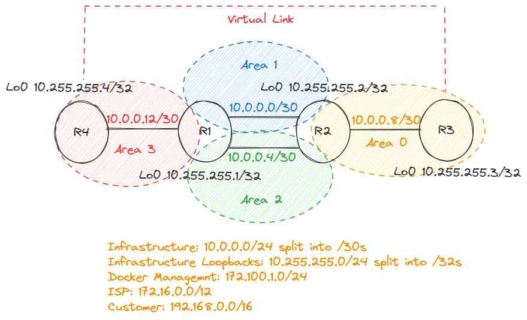
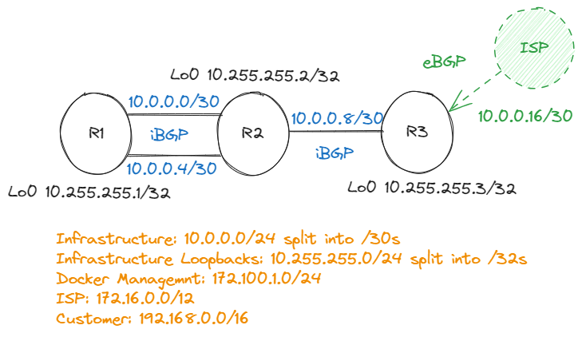

# Service Provider Routing and Switching, Specialist (JNCIS-SP) (JN0-363) -- Labs

>"I hear and I forget. I see and I remember. I do and I understand." – Confucius

>NOTE:
>
>This work is still in progress (but I wanted the use of wi-ki to run through and document the different lab scenarios as I progress through the course) 

These labs are part of my preparation for [JNCIS-SP](https://www.juniper.net/gb/en/training/certification/tracks/service-provider-routing-switching/jncis-sp.html) certification. 
The intention is to create a series of readily available labs, encompassing all conceivable topics related to this exam track, that I am able to replicate in this virtualised environment."


The labs are broken down by [exam topics](https://www.juniper.net/gb/en/training/certification/tracks/service-provider-routing-switching/jncis-sp.html)

- [Protocol-Independent Routing](#protocol-independent-routing)
- [Open Shortest Path First (OSPF)](#open-shortest-path-first)
- [Intermediate System to Intermediate System (IS-IS)](#intermediate-system-to-intermediate-system)
- [Border Gateway Protocol (BGP)](#border-gateway-protocol)
- [Layer 2 Bridging or VLANs](#layer-2-bridging)
- [Spanning-Tree Protocols](#spanning-tree-protocols)
- [Multiprotocol Label Switching (MPLS)](#multiprotocol-label-switching)
- [IPv6](#ipv6)
- [Tunnels](#tunnels)
- [High Availability](#high-availability)

Using Makefile, each lab is set up with the appropriate topology and foundational configuration using Containerlab, in conjunction with Ansible and a selection of other scripts and tools. The base configuration includes essential prerequisites like interface descriptions and IP assignments, enabling you to dive directly into the specific learning objectives in question.

>PREREQUISITES & ADMINISTRATION:
>
> - [Containerlab](https://containerlab.dev/)
> - [Ansible](https://www.juniper.net/documentation/us/en/software/junos-ansible/ansible/topics/concept/junos-ansible-modules-overview.html)
> - [Docker images](https://www.redhat.com/en/topics/containers/what-is-docker?sc_cid=7013a0000026OQwAAM&gclid=CjwKCAjw8symBhAqEiwAaTA__FWw8RjodY_dtI7BjNtE4cNU8Lw48xDIH7Qn6Q_X-YUQH4yvjB8bdRoCmBEQAvD_BwE&gclsrc=aw.ds)
> - [Jinja2](https://pypi.org/project/Jinja2/)
> - [Expect](https://phoenixnap.com/kb/linux-expect)
>
>Please make sure to verify and update any paths and username referenced in any playbooks, scripts or variables

---

## Protocol-Independent Routing

This lab covers the learning objectives for Protocol-Independent Routing.

This is the lab topology diagram:


Lab is deployed by running the following command:
```
make start-pir
```

Lab is destroyed by running the following command:
```
make stop-pir
```

### Objectives

- Static, aggregate, and generated routes
- Configuration and monitoring of static, aggregate, and generated routes
- Martian routes and how to add new entries to the default list
- Routing instances and their typical uses
- Configuration and sharing of routes between routing instances

---

## Open Shortest Path First

This lab covers the learning objectives for OSPF Routing.

This is the lab topology diagram:


---

## Intermediate System to Intermediate System

This lab covers the learning objectives for ISIS Routing.

This is the lab topology diagram:


---

## Border Gateway Protocol

This lab covers the learning objectives for BGP.

> NOTE:
> This lab uses exaBGP that peers with `r3` to generate 172.16.%d.0/24 networks. Only requirement is to build the Docker image prior to deploying the lab. All files are located in ./docker folder. The Docker image is built from that folder with the following command:  docker build -t bgp-isp .

eBGP peering with `r3` and `isp1` is part of the base config and deployed when the lab starts. The routes should be received on `r3` but not accepted yet, leaving the options of required filtering to the actual labs.
```
anton@r3> show bgp summary                                    
Threading mode: BGP I/O
Default eBGP mode: advertise - accept, receive - accept
Groups: 1 Peers: 1 Down peers: 0
Table          Tot Paths  Act Paths Suppressed    History Damp State    Pending
inet.0               
                     255        255          0          0          0          0
Peer                     AS      InPkt     OutPkt    OutQ   Flaps Last Up/Dwn State|#Active/Received/Accepted/Damped...
10.0.0.18             65000          8          6       0       0        2:01 Establ
  inet.0: 255/255/255/0

anton@r3> show route receive-protocol bgp 10.0.0.18 hidden    

inet.0: 260 destinations, 260 routes (260 active, 0 holddown, 0 hidden)

### Objectives
- BGP basic operation
- BGP message types
- Attributes
- Route/path selection process
- Internal and external BGP (IBGP and EBGP) functionality and interaction
- Groups and peers
- Additional basic options
- Routing policy application

```

This is the lab topology diagram:



Lab is deployed by running the following command:
```
make start-bgp
```

Lab is destroyed by running the following command:
```
make stop-bgp
```
---

## Layer 2 Bridging

---

## Spanning-Tree Protocols

---

## Multiprotocol Label Switching

---

## IPv6

---

## Tunnels

---

## High Availability

---

## Demo of staring the lab:

```
anton@mcc:~/git_hub/ansible-juniper-lab-jncis-sp-public$ make start-pir 
Executing playbook to deploy Protocol Independent Routing topology with nodes r1,r2,r3
[WARNING]: Invalid characters were found in group names but not replaced, use -vvvv to see details
Enter the sudo password: 

PLAY [Deploy Containerlab Topology] ************************************************************************************************************************************************************************************************

TASK [Run clab deploy command] *****************************************************************************************************************************************************************************************************
changed: [localhost]

TASK [Wait for the deployment to complete] *****************************************************************************************************************************************************************************************
Pausing for 180 seconds
(ctrl+C then 'C' = continue early, ctrl+C then 'A' = abort)
ok: [localhost]

TASK [Check Docker containers status] **********************************************************************************************************************************************************************************************
changed: [localhost]

TASK [Check for healthy status] ****************************************************************************************************************************************************************************************************
ok: [localhost] => {
    "msg": "All containers are healthy"
}

PLAY RECAP *************************************************************************************************************************************************************************************************************************
localhost                  : ok=4    changed=2    unreachable=0    failed=0    skipped=0    rescued=0    ignored=0   

Waiting 10 seconds before running script
Executing script to enable ssh/rsa auth on the nodes
spawn ./scripts/deploy-conf-file -config ./configuration/sshRSA.cfg
Enter the Juniper nodes (IP addresses or hostnames):seperated by comma
r1,r2,r3
Successfully executed configuration on r1
Successfully executed configuration on r2
Successfully executed configuration on r3
Waiting 3 seconds before rendering config
Running playbook to render configuration
[WARNING]: Invalid characters were found in group names but not replaced, use -vvvv to see details

PLAY [vr-vmx] **********************************************************************************************************************************************************************************************************************

TASK [Include variables from r1.yml] ***********************************************************************************************************************************************************************************************
skipping: [r2]
skipping: [r3]
ok: [r1]

TASK [Include variables from r2.yml] ***********************************************************************************************************************************************************************************************
skipping: [r1]
skipping: [r3]
ok: [r2]

TASK [Include variables from r3.yml] ***********************************************************************************************************************************************************************************************
skipping: [r1]
skipping: [r2]
ok: [r3]

TASK [Render configuration template] ***********************************************************************************************************************************************************************************************
ok: [r3]
ok: [r1]
ok: [r2]

PLAY RECAP *************************************************************************************************************************************************************************************************************************
r1                         : ok=2    changed=0    unreachable=0    failed=0    skipped=2    rescued=0    ignored=0   
r2                         : ok=2    changed=0    unreachable=0    failed=0    skipped=2    rescued=0    ignored=0   
r3                         : ok=2    changed=0    unreachable=0    failed=0    skipped=2    rescued=0    ignored=0   

Running playbook to configure nodes
[WARNING]: Invalid characters were found in group names but not replaced, use -vvvv to see details

PLAY [Load and commit base configuration] ******************************************************************************************************************************************************************************************

TASK [Load configuration from a local file and commit] *****************************************************************************************************************************************************************************
changed: [r1]
changed: [r3]
changed: [r2]

TASK [Print the response] **********************************************************************************************************************************************************************************************************
ok: [r1] => {
    "response": {
        "changed": true,
        "diff": {
            "prepared": "\n[edit interfaces]\n+   ge-0/0/0 {\n+       description \"Link from R1 to R2 - primary\";\n+       unit 0 {\n+           family inet {\n+               address 10.0.0.1/24;\n+           }\n+       }\n+   }\n+   ge-0/0/2 {\n+       description \"Link from R1 to R2 - secondary\";\n+       unit 0 {\n+           family inet {\n+               address 10.20.20.1/24;\n+           }\n+       }\n+   }\n+   lo0 {\n+       unit 0 {\n+           family inet {\n+               address 10.100.100.1/32;\n+           }\n+       }\n+   }\n"
        },
        "diff_lines": [
            "",
            "[edit interfaces]",
            "+   ge-0/0/0 {",
            "+       description \"Link from R1 to R2 - primary\";",
            "+       unit 0 {",
            "+           family inet {",
            "+               address 10.0.0.1/24;",
            "+           }",
            "+       }",
            "+   }",
            "+   ge-0/0/2 {",
            "+       description \"Link from R1 to R2 - secondary\";",
            "+       unit 0 {",
            "+           family inet {",
            "+               address 10.20.20.1/24;",
            "+           }",
            "+       }",
            "+   }",
            "+   lo0 {",
            "+       unit 0 {",
            "+           family inet {",
            "+               address 10.100.100.1/32;",
            "+           }",
            "+       }",
            "+   }"
        ],
        "failed": false,
        "file": "./configuration/r1-base-config.txt",
        "msg": "Configuration has been: opened, loaded, checked, diffed, committed, closed."
    }
}
ok: [r3] => {
    "response": {
        "changed": true,
        "diff": {
            "prepared": "\n[edit interfaces]\n+   ge-0/0/1 {\n+       description \"Link from R3 to R2\";\n+       unit 0 {\n+           family inet {\n+               address 10.0.1.3/24;\n+           }\n+       }\n+   }\n+   lo0 {\n+       unit 0 {\n+           family inet {\n+               address 10.100.100.3/32;\n+           }\n+       }\n+   }\n"
        },
        "diff_lines": [
            "",
            "[edit interfaces]",
            "+   ge-0/0/1 {",
            "+       description \"Link from R3 to R2\";",
            "+       unit 0 {",
            "+           family inet {",
            "+               address 10.0.1.3/24;",
            "+           }",
            "+       }",
            "+   }",
            "+   lo0 {",
            "+       unit 0 {",
            "+           family inet {",
            "+               address 10.100.100.3/32;",
            "+           }",
            "+       }",
            "+   }"
        ],
        "failed": false,
        "file": "./configuration/r3-base-config.txt",
        "msg": "Configuration has been: opened, loaded, checked, diffed, committed, closed."
    }
}
ok: [r2] => {
    "response": {
        "changed": true,
        "diff": {
            "prepared": "\n[edit interfaces]\n+   ge-0/0/0 {\n+       description \"Link from R2 to R1 - primary\";\n+       unit 0 {\n+           family inet {\n+               address 10.0.0.2/24;\n+           }\n+       }\n+   }\n+   ge-0/0/1 {\n+       description \"Link from R2 to R3\";\n+       unit 0 {\n+           family inet {\n+               address 10.0.1.2/24;\n+           }\n+       }\n+   }\n+   ge-0/0/2 {\n+       description \"link from R2 to R1 - secondary\";\n+       unit 0 {\n+           family inet {\n+               address 10.20.20.2/24;\n+           }\n+       }\n+   }\n+   lo0 {\n+       unit 0 {\n+           family inet {\n+               address 10.100.100.2/32;\n+           }\n+       }\n+   }\n"
        },
        "diff_lines": [
            "",
            "[edit interfaces]",
            "+   ge-0/0/0 {",
            "+       description \"Link from R2 to R1 - primary\";",
            "+       unit 0 {",
            "+           family inet {",
            "+               address 10.0.0.2/24;",
            "+           }",
            "+       }",
            "+   }",
            "+   ge-0/0/1 {",
            "+       description \"Link from R2 to R3\";",
            "+       unit 0 {",
            "+           family inet {",
            "+               address 10.0.1.2/24;",
            "+           }",
            "+       }",
            "+   }",
            "+   ge-0/0/2 {",
            "+       description \"link from R2 to R1 - secondary\";",
            "+       unit 0 {",
            "+           family inet {",
            "+               address 10.20.20.2/24;",
            "+           }",
            "+       }",
            "+   }",
            "+   lo0 {",
            "+       unit 0 {",
            "+           family inet {",
            "+               address 10.100.100.2/32;",
            "+           }",
            "+       }",
            "+   }"
        ],
        "failed": false,
        "file": "./configuration/r2-base-config.txt",
        "msg": "Configuration has been: opened, loaded, checked, diffed, committed, closed."
    }
}

PLAY RECAP *************************************************************************************************************************************************************************************************************************
r1                         : ok=2    changed=1    unreachable=0    failed=0    skipped=0    rescued=0    ignored=0   
r2                         : ok=2    changed=1    unreachable=0    failed=0    skipped=0    rescued=0    ignored=0   
r3                         : ok=2    changed=1    unreachable=0    failed=0    skipped=0    rescued=0    ignored=0   

Lab setup complete with basic configuration

>[!INFO]
> EXAM OBJECTIVES: Identiy the concepts, operation, and functionality of various protocol-independent routing components;

- Static, aggregate, and generated routes
- Martian addresses
- Routing instances, including routing information base (RIB) (also known as routing table) group
- Load balancing
- Filter-based forwarding

>[!IMPORTANT]
>Demonstrate knowledge of how to configure, monitor, and troubleshoot various protocol-independent routing components:

- Static, aggregate, and generated routes
- Load balancing
- Filter-based forwarding
```
